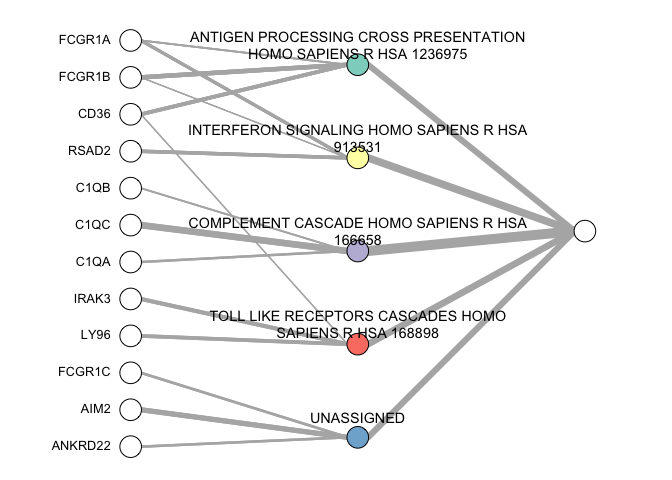

<!-- README.md is generated from README.Rmd. Please edit that file -->

# xnnet0

<!-- badges: start -->

<!-- badges: end -->

The goal of xnnet0 is to build interpretable neural netwroks to solve a
classification problem.

## Installation

You can install the development version from
[GitHub](https://github.com/) with:

``` r
devtools::install_git("bioinfo/xnnet0")
```

## Example

This is a basic example

\#\#Building xnnet

``` r
library(xnnet0)
#> Loading required package: dplyr
#> 
#> Attaching package: 'dplyr'
#> The following objects are masked from 'package:stats':
#> 
#>     filter, lag
#> The following objects are masked from 'package:base':
#> 
#>     intersect, setdiff, setequal, union
#> Loading required package: ggplot2
#> Loading required package: testthat
#> 
#> Attaching package: 'testthat'
#> The following object is masked from 'package:dplyr':
#> 
#>     matches
#> Registered S3 method overwritten by 'seriation':
#>   method         from 
#>   reorder.hclust gclus
data("GSE37250") #load Tubercolosis dataset
data("annotation_libraries")
GSE37250_split = train_test_split(GSE37250$X, GSE37250$y)
#> [1] "####### class 0 frequency:  0.4 #######"
#> [1] "####### class 1 frequency:  0.6 #######"
#> [1] "####### training set has 35 samples and 31426 variables #######"
#> [1] "####### test set has 15 samples and 31426 variables #######"
xnnet = build_xnnet(X_train = GSE37250_split$X_train, y_train = GSE37250_split$y_train,
annotation_libraries = annotation_libraries)
#> [1] "step 1 of 3: performing Limma"
#> [1] "done"
#> [1] "step 2 of 3: processing GSEA results"
#> [1] "done"
#> [1] "step 3 of 3: cross-validating neural networks"
#> Loading required package: lattice
#> [1] "done"
```

\#\#Plotting xnnet

``` r
plot_xnnet(xnnet$Reactome_2016)
```


