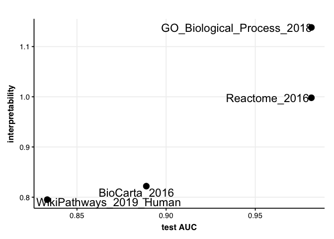
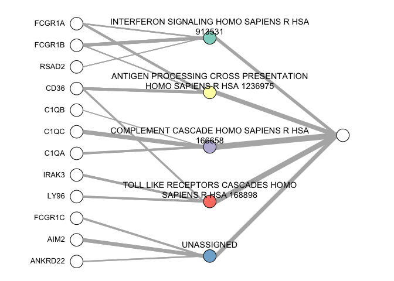

<!-- README.md is generated from README.Rmd. Please edit that file -->

# xnnet0

<!-- badges: start -->

<!-- badges: end -->

The goal of xnnet0 is to build interpretable neural netwroks to solve a
classification problem.

## Installation

You can install the development version from
[GitHub](https://github.com/) with:

``` r
devtools::install_git("bioinfo/xnnet0")
```

## Example

This is a basic example

## Building xnnet

``` r
library(xnnet0)
data("GSE37250") #load Tubercolosis dataset
data("annotation_libraries")
GSE37250_split = train_test_split(GSE37250$X, GSE37250$y)
#> [1] "####### class 0 frequency:  0.4 #######"
#> [1] "####### class 1 frequency:  0.6 #######"
#> [1] "####### training set has 35 samples and 31426 variables #######"
#> [1] "####### test set has 15 samples and 31426 variables #######"
xnnet = build_xnnet(X_train = GSE37250_split$X_train, y_train = GSE37250_split$y_train,
annotation_libraries = annotation_libraries)
#> [1] "step 1 of 3: performing Limma"
#> [1] "done"
#> [1] "step 2 of 3: processing GSEA results"
#> [1] "done"
#> [1] "step 3 of 3: cross-validating neural networks"
#> [1] "done"
```

## Predictions and evaluation

``` r
#predictions on test set
xnnet_predictions = xnnet_predict(xnnet, X_test = GSE37250_split$X_test)

#assess model performance
xnnet_performance = assess_xnnet_performance(xnnet, xnnet_predictions, true_labels = GSE37250_split$y_test)

xnnet_performance$AUC_plot 
```


``` r
xnnet_performance$AUC_interpretability_plot
```



## Plotting xnnet

``` r
plot_xnnet(xnnet$Reactome_2016)
```



## Plotting the average hidden node in the two classes

``` r
# library(ggradar)
#  
# sample_activation = compute_hidden_activation(xnnet$Reactome_2016, X = GSE37250_split$X_train, y = GSE37250_split$y_train)
# 
# mean_hidden_activation = sample_activation %>%
#   dplyr::select(-sample) %>% dplyr::group_by(class) %>%
#   dplyr::summarise_all(mean)
# 
# ggradar(mean_hidden_activation)
```
